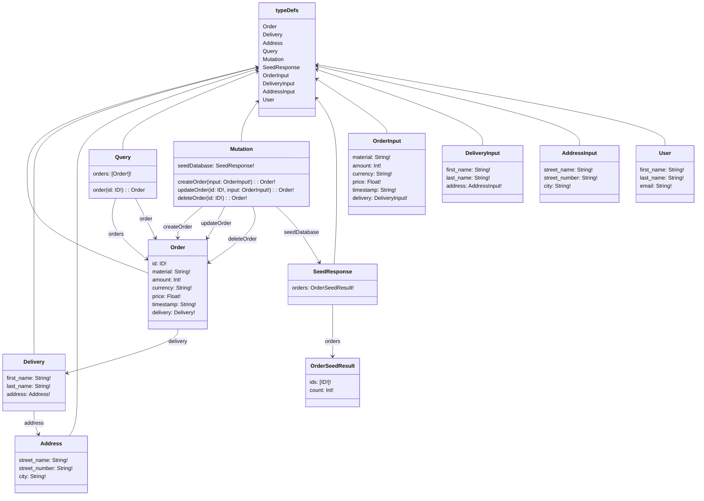

# Lecture 07 Excercises

## Exercise 1 - Authentication and authorization
the GraphQl schema is as follows after adding the user type 

### 1.1

Add register and login for user to exercise 3.1 from lecture 6.

- Add a user type to the schema, a mutation to register, and a login query that will return a jwt if provided with the right credentials.
You can be inspired by this REST based demo <https://jasonwatmore.com/nodejs-jwt-authentication-tutorial-with-example-api>

### 1.2

Add authorization to your server app so only authenticated users can add new books. You can find help here: <https://www.apollographql.com/docs/apollo-server/security/authentication>

## Exercise 2 - Use PostgreSQL as data store

### 2.1

1. Start PostgreSQL in a container - I suggest that you use postgres:16.2-alpine <https://hub.docker.com/_/postgres>.
2. Use pgAdmin 4 <https://www.pgadmin.org/docs/pgadmin4/6.20/index.html> to connect to your PostgreSQL database. You can run pgAdmin4 in a container <https://hub.docker.com/r/dpage/pgadmin4/>. Create a docker compose file that spins up both containers. Setup a new database with two tables that can replace the books and users arrays as data store, and populate the books table with some data.
3. Change you app from exercise 1 so that it connects to your PostgreSQL DB, and uses the database as data store. You may get some help here: <https://node-postgres.com/>.

## Exercise 3 - Use Prisma

### 3.1

Follow this guide <https://www.prisma.io/docs/getting-started/setup-prisma/start-from-scratch/relational-databases-typescript-postgresql>

## Exercise 4 - GraphQL CRUD API with TypeGraphQL & Prisma

### 4.1

Follow this guide but use PostgresQL instead of SQLite: <https://dev.to/prisma/prototyping-a-crud-api-with-typegraphql-and-prisma-for-your-database-424c>

## Exercise 5 - Dataloader

### 5.1

Add use of the Dataloader to your solution to exercise 07-2.1.
