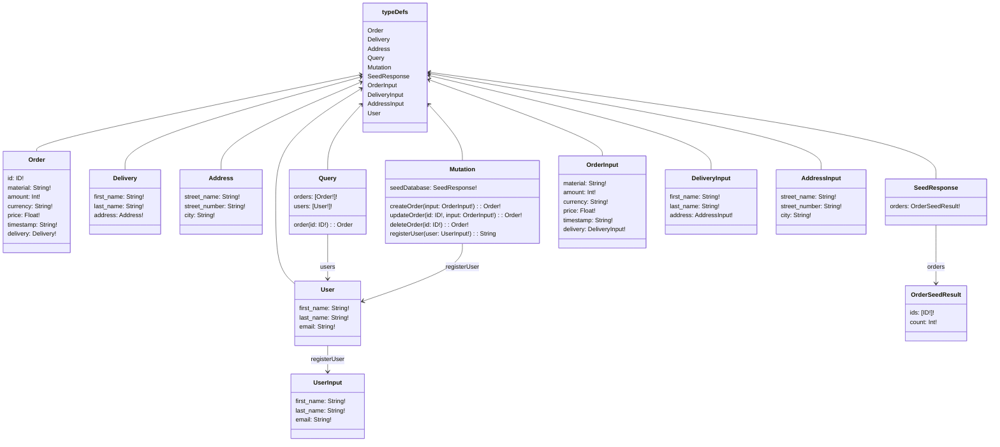
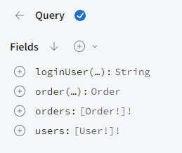
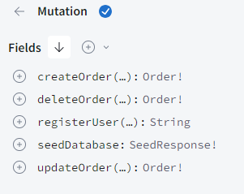

# Lecture 07 Excercises

## Exercise 1 - Authentication and authorization
the GraphQl schema is as follows after adding the user type 



### 1.1


Add register and login for user to exercise 3.1 from lecture 6.

- Add a user type to the schema, a mutation to register, and a login query that will return a jwt if provided with the right credentials.
You can be inspired by this REST based demo <https://jasonwatmore.com/nodejs-jwt-authentication-tutorial-with-example-api>

 
> after adding the user type to the schema, a mutation to register, and a login query that will return a jwt if provided with the right credentials. I was able to register a user and login to get a token.
we can also see the user in the database after registering it.

### 1.2

Add authorization to your server app so only authenticated users can add new books. You can find help here: <https://www.apollographql.com/docs/apollo-server/security/authentication>
> adding auth.ts and using it to check if the user is authenticated before adding a new order to the database.
Remember to add the context to the server to be able to use the user object in the resolvers.
And to include the token generated at login in the request headers when adding a new order

## Exercise 2 - Use PostgreSQL as data store

### 2.1

1. Start PostgreSQL in a container - I suggest that you use postgres:16.2-alpine <https://hub.docker.com/_/postgres>.
2. Use pgAdmin 4 <https://www.pgadmin.org/docs/pgadmin4/6.20/index.html> to connect to your PostgreSQL database. You can run pgAdmin4 in a container <https://hub.docker.com/r/dpage/pgadmin4/>. Create a docker compose file that spins up both containers. Setup a new database with two tables that can replace the books and users arrays as data store, and populate the books table with some data.
    > the docker compose file is as follows
    ```yaml
    version: '3.8'

    services:
    postgres:
        image: postgres:16.2-alpine
        environment:
        POSTGRES_PASSWORD: ilovecake
        ports:
        - "5432:5432"
        volumes:
        - postgres_data:/var/lib/postgresql/data

    pgadmin:
        image: dpage/pgadmin4
        environment:
        PGADMIN_DEFAULT_EMAIL: admin@example.com
        PGADMIN_DEFAULT_PASSWORD: admin
        ports:
        - "5050:80"
        depends_on:
        - postgres

    volumes:
    postgres_data:

    ```

    > the database is created and the tables are created as follows
    ```sql

    CREATE TABLE users (
        id SERIAL PRIMARY KEY,
        username VARCHAR(255) NOT NULL,
        password VARCHAR(255) NOT NULL
    );

    CREATE TABLE addresses (
        id SERIAL PRIMARY KEY,
        street_name VARCHAR(255) NOT NULL,
        street_number VARCHAR(255) NOT NULL,
        city VARCHAR(255) NOT NULL
    );

    CREATE TABLE deliveries (
        id SERIAL PRIMARY KEY,
        first_name VARCHAR(255) NOT NULL,
        last_name VARCHAR(255) NOT NULL,
        address_id INT NOT NULL,
        FOREIGN KEY (address_id) REFERENCES addresses(id)
    );


    CREATE TABLE orders (
        id SERIAL PRIMARY KEY,
        material VARCHAR(255) NOT NULL,
        amount INT NOT NULL,
        currency VARCHAR(255) NOT NULL,
        price FLOAT NOT NULL,
        timestamp TIMESTAMP NOT NULL,
        delivery_id INT NOT NULL,
        FOREIGN KEY (delivery_id) REFERENCES deliveries(id)
    );
    ```


3. Change you app from exercise 1 so that it connects to your PostgreSQL DB, and uses the database as data store. You may get some help here: <https://node-postgres.com/>.

## Exercise 3 - Use Prisma

### 3.1

Follow this guide <https://www.prisma.io/docs/getting-started/setup-prisma/start-from-scratch/relational-databases-typescript-postgresql>

## Exercise 4 - GraphQL CRUD API with TypeGraphQL & Prisma

### 4.1

Follow this guide but use PostgresQL instead of SQLite: <https://dev.to/prisma/prototyping-a-crud-api-with-typegraphql-and-prisma-for-your-database-424c>

## Exercise 5 - Dataloader

### 5.1

Add use of the Dataloader to your solution to exercise 07-2.1.
